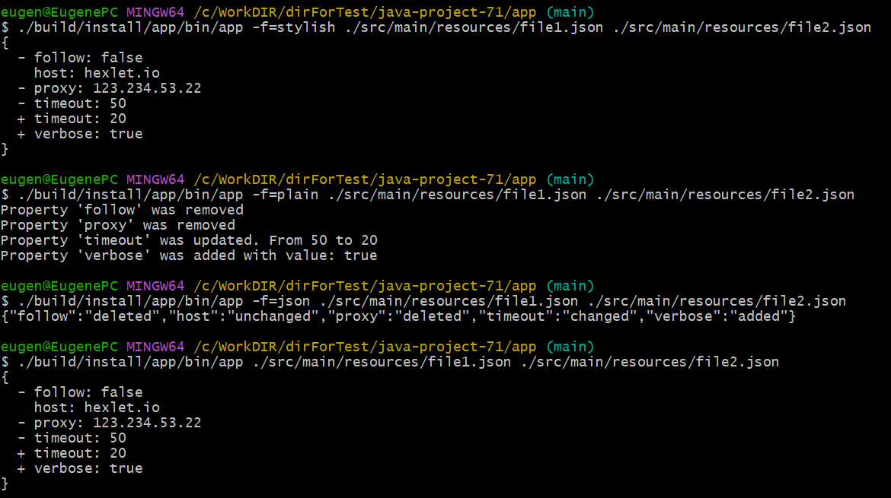

### Hexlet tests and linter status:

# Вычислитель отличий

Вычислитель отличий – это программа, которая определяет разницу между двумя структурами данных. Такой механизм широко используется при выводе тестов или для автоматического отслеживания изменений в конфигурационных файлах.

## Возможности утилиты

- **Поддержка разных входных форматов:**
    - YAML
    - YML
    - JSON

- **Генерация отчета в различных форматах:**
    - Plain text _(-f=plain)_
    - Stylish _(-f=stylish)_
    - JSON _(-f=json)_

## Пример использования

